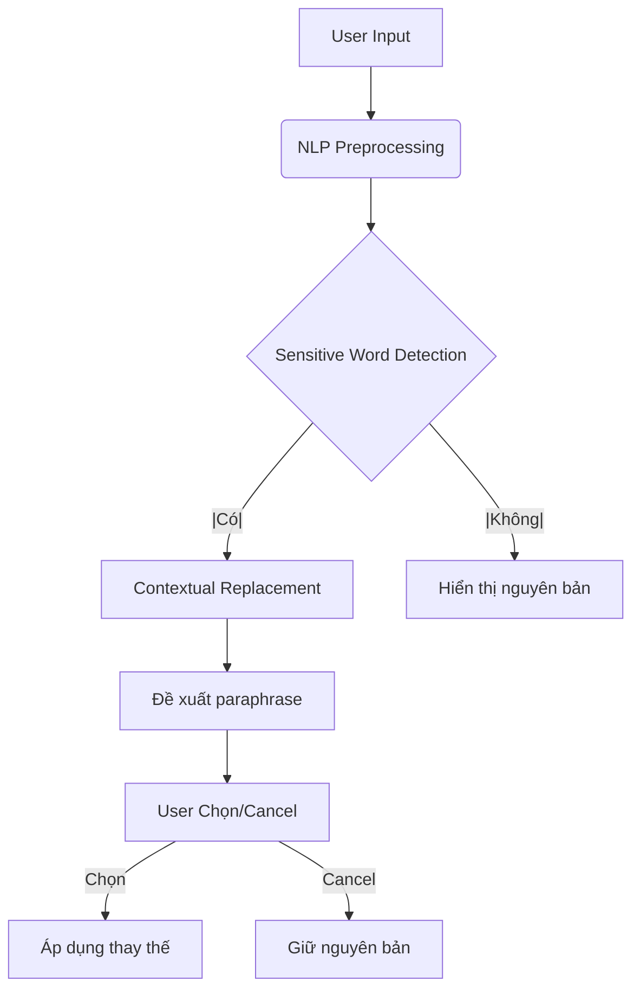

# Social Media Language Filter Extension 🌐✨

Chrome Extension sử dụng NLP để lọc & thay thế từ ngữ không phù hợp trong tin nhắn/bình luận, giúp giáo dục người dùng giao tiếp an toàn trên mạng xã hội mà vẫn giữ nguyên sắc thái câu.

## ✨ Tính năng chính
- **Phát hiện & thay thế từ nhạy cảm**: Tự động đề xuất từ ngữ chuẩn mực (VD: "Đù má" → "Wow").
- **Giữ nguyên ngữ cảnh**: Duy trì ý nghĩa gốc và sắc thái câu khi thay thế.
- **Hoạt động thời gian thực**: Quét nội dung ngay khi người dùng nhập liệu.
- **Tuỳ chỉnh cấp độ lọc**: 3 chế độ (Cơ bản/Trung bình/Chặt chẽ).

## 🛠 Công nghệ sử dụng
| Mục đích               | Công cụ/Công nghệ                                   |
|-------------------------|----------------------------------------------------|
| Xử lý ngôn ngữ tự nhiên | **Transformers** (Hugging Face), **spaCy**         |
| Mô hình phân loại       | **BERT** fine-tuning, **FastText**                 |
| Chrome Extension        | **React** + **TypeScript**, Chrome API             |
| Web Scraping dữ liệu    | **Scrapy**, **Beautiful Soup**                     |
| Backend (tuỳ chọn)      | **Flask**/FastAPI (nếu cần xử lý server-side)      |
| Quản lý từ điển         | Từ điển custom JSON kết hợp [Unicode CLDR](http://cldr.unicode.org/)|

## 📂 Dataset
- Nguồn dữ liệu:
  - Comment từ Facebook, Tiktok, Instagram (sử dụng web scraping)
  - Các bộ từ điển tiếng lóng Việt Nam (VD: [vietnamese-slang](https://github.com/duyet/vietnamese-slang))
  - Dữ liệu tổng hợp từ [UIT VSFC](https://sites.google.com/uit.edu.vn/uit-nlp/datasets-projects)
- Xử lý dữ liệu:
  - Gán nhãn từ nhạy cảm với **Prodigy** 
  - Augmentation dữ liệu bằng **TextAttack**

## 🌟 Cách thức hoạt động

## 🤝 Đóng góp
- Báo cáo lỗi qua [Issues](https://github.com/[username]/social-media-language-filter/issues)
- Thêm từ vào từ điển: Chỉnh sửa `data/slang_dictionary.json`
- Đóng góp model: Xem hướng dẫn tại `model/CONTRIBUTING.md`

## 📜 Giấy phép
MIT License - Xem [LICENSE](LICENSE)

---

**Bảo vệ trẻ em từ những con chữ** ❤️  

Để tối ưu, bạn nên:
1. Thêm file `.gif` demo vào thư mục `/assets`
2. Customize phần dataset với các nguồn dữ liệu cụ thể
3. Thêm hướng dẫn chi tiết về cách train model trong `model/README.md`
